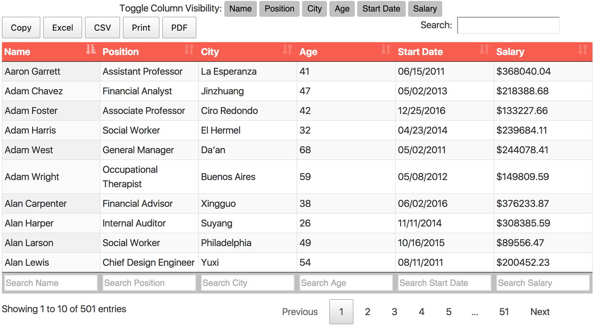

DataTables Sample Project
====
A sample project that demonstrates [Datatables](https://datatables.net), which is a plug-in for jQuery. It is a highly flexible tool, based upon the foundations of progressive enhancement, and will add advanced interaction controls to any HTML table.

See a [ working demo](https://baksoy.github.io/datatables/)

Features:
- HTML Table with Pagination
- Hide specific columns (use when you want to show a different view)
- Toggle Column Visibility
- Search on Multiple Columns
- Button to copy all rows to clipboard
- Button to export to Excel, CSV, Pdf
- Button for Printable View
- Search highlighting with mark.js
- Filter column visibility before printing  

**Demonstrating search on multiple columns, then filtering column visibility and then exporting to PDF**

----------
Download it and mofiy it to your heart's content!

Please visit [DataTables](https://datatables.net/) for licensing and documentation

